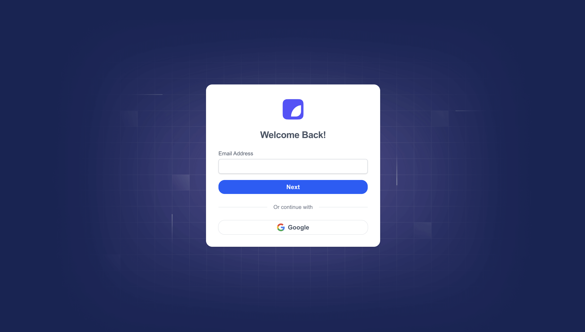
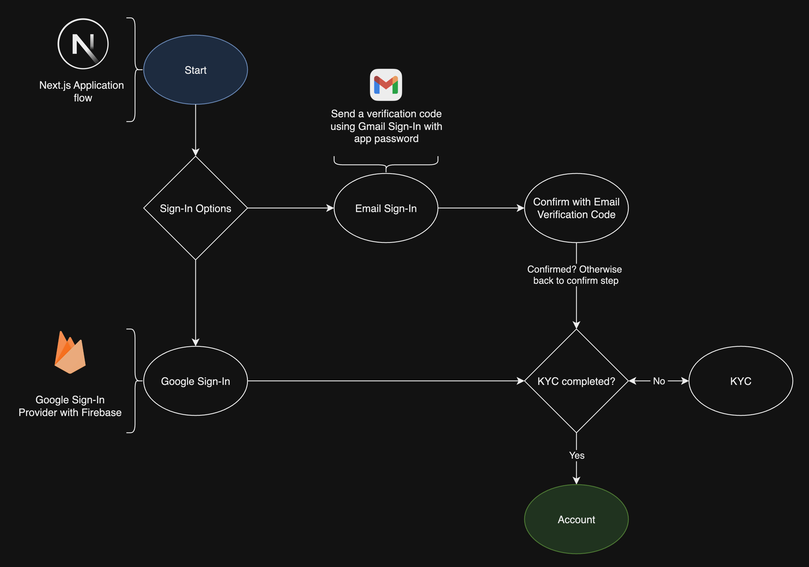
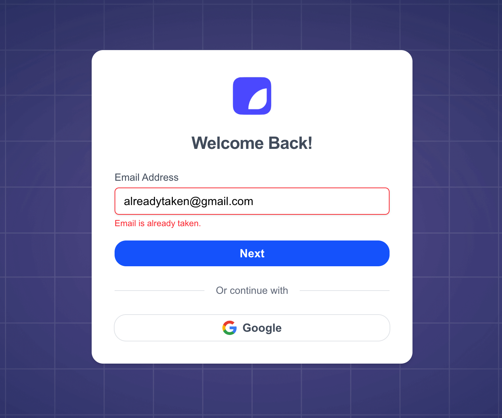
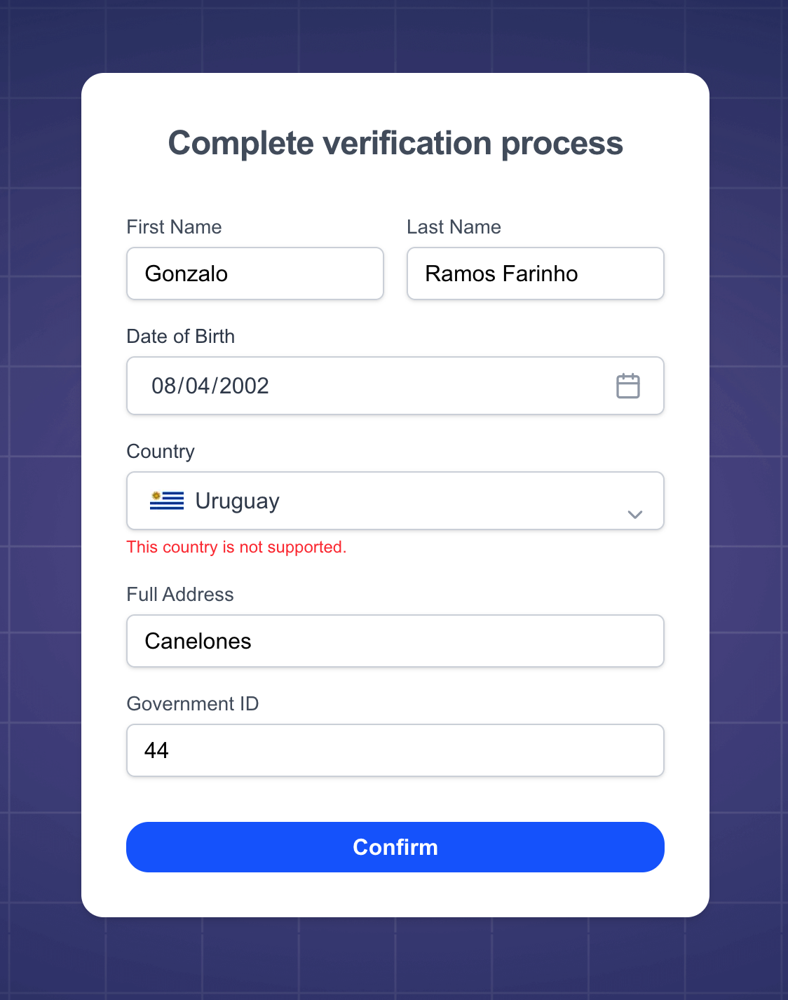

# Gomry challenge: Wallet Signup Flow

Application in charge of wallet web-based signup flow. [Check it out here!](https://gomry-challenge.vercel.app/login)



---

## Content
1. [Introduction](#introduction)
    1. [Application flow and system design](#application-flow-and-system-design)
    2. [Database](#database) 
    3. [Challenge requirements overview](#challenge-requirements-overview)
2. [Quick start](#quick-start)
3. [Running tests](#running-tests)
4. [Dependencies](#dependencies)
5. [Project structure](#project-structure)
6. [Design decisions and considerations](#design-decisions-and-considerations)
7. [Final thoughts / potential enhancements](#final-thoughts--potential-enhancements)

---

## Introduction
The goal of this project is to deliver a fully functional and user-friendly web-based signup flow for a digital wallet 
application, built with Next.js and Firebase. This flow is designed to be publicly accessible and provides users with 
two flexible authentication options: email-based login with verification code, and Google Sign-In using Firebase 
Authentication.  

After authentication, users are required to complete a KYC (Know Your Customer) verification process to access their 
account. This process includes collecting personal information such as name, full address, date of birth, and government 
ID. The application ensures that users who have not yet completed KYC are redirected to the verification page until the 
process is fully completed.

### Application flow and system design
This diagram serves to understand the signup flow in the application. This graph is not following any rules or 
convention, use it just as a quick hint.



Link to full access view in draw.io, [click here.](https://drive.google.com/file/d/1CVivEq-XFce_sFkAt8juWhNYMEGmtPr6/view?usp=sharing)

### Database
This project uses Firebase Firestore as the main database. Users are stored under the `users` collection. Below is the 
schema for a typical user document:

```aiignore
Collection: users
Document ID: <auto-generated UID>
{
  "uid": Document ID,
  "email": string,
  "firstName": string,
  "lastName": string,
  "dateOfBirth": string,
  "country": string,
  "governmentId": string,
  "fullAddress": string,
  "completedKyc": boolean
}
```

> * Google Sign-In or Email Sign-In both results in the creation of a user document under this structure.
> * The uid field matches the Firebase Authentication UID.

### Challenge requirements overview

Specific validation and error-handling cases required by the challenge.



> **_NOTE:_** Attempting to sign up with the email alreadytaken@gmail.com shows: "Email is already taken." message



> **_NOTE:_** If the user selects Uruguay as their country during the signup process, show the following message 
> "This country is not supported."

---

## Quick start

Ensure you are using **Node.js 22**

```bash
git clone git@github.com:gonzaloramosf/gomry-challenge.git
```

```bash
npm run install
```

```bash
npm run dev
```

The application will be available at http://localhost:3000 by default.

Ready!

---

## Running tests

This project uses `Vitest` for testing along with `@testing-library/react`.

```bash
npm run test
```

To run tests in watch mode:

```bash
npm run test:watch
```

---

## Dependencies

This Next.js project uses mainly the following dependencies:

* [**Tailwind CSS**](https://tailwindcss.com/): Utility-first CSS framework for rapid UI development
* [**Tailwind Variants**](https://www.tailwind-variants.org/): Utility-based component styling system for extending 
Tailwind with reusable, variant-based styling.
* [**Firebase**](https://firebase.google.com/): Used for authentication (Email and Google Sign-In), Firestore database 
storage, and managing user sessions.
* [**Nodemailer**](https://www.nodemailer.com/): Handles sending email verification codes to users using Gmail.

---

## Project structure

This project is not following any specific rule, just some common conventions and experience from past developments.
Some ideas were loosely inspired by [this article](https://medium.com/@mertenercan/nextjs-13-folder-structure-c3453d780366), 
but nothing specific was enforced.

* `/`: Root of the project containing config, app, and core folders.
* `public`: Static assets like images and favicon served directly by Next.js.
* `src`:
  * `app`
    * `api`: API route handlers (e.g., auth endpoints)
    * `pages`: See note below.
  * `components`: Reusable UI components shared across the entire app.
    * `Button`
      * `__test__`
      * `styles`
      * `index.tsx`
  * `lib`: Client/server configuration files.
  * `services`: Client-side functions to interact with API routes (e.g., auth).
  * `stores`: React contexts for global state (e.g., User).
  * `styles`: Global styles and Tailwind setup.
  * `test`: Test environment setup files.
  * `types`: Shared TypeScript types.
  * `utils`: General utilities and constants for app-wide use.
  * `middleware.ts`: Middleware to protect routes and manage session logic.

> **_NOTE:_** Pages are defined under the `app` directory.  
> For example:
> * `app`
>   * `login`
>     * `components`: Specific to the login page.
>     * `page.tsx`: Main entry point for the page.

---

## Design decisions and considerations

### Preventing Known Failures in UX

One of the challenge requirements was to show an error if the user selects Uruguay as their country. While I implemented 
this as requested, I do not fully agree with the approach from a UX perspective.

> I think a core UX principle is to avoid letting users go through a flow that is guaranteed to end in 
> failure—especially when the system can anticipate it. In this case, it would have been better to prevent the selection 
> entirely rather than allowing it and showing an error afterward.

That said, I understand there are situations where this is not always feasible—some validation rules may depend on 
dynamic data or other backend logic. But whenever possible, the UX should guide users to avoid invalid paths before 
they commit to them.

### KYC step in the flow

One of the challenge requirements was to collect KYC information as part of the sign-in flow. I believe this approach 
can be improved from a product and UX perspective.

> Instead of requiring KYC upfront, it may be more effective to let users access the application first—exploring the 
> interface and understanding its value.

### Authentication Expiry Details

* User sessions expire after 2 hours.
* Verification codes sent via email are valid for 5 minutes.

---

## Final thoughts / potential enhancements

* **Dockerized local environment**: simplify setup and ensure consistency across development environments.
* **Additional test coverage**: increase coverage across components and key user flows.
* **Centralized styles customization**: Define global constants for shared styles (e.g., colors, spacing, border radius). 
This would make it easy to apply future design updates—such as changing a primary color or adjusting button rounding—by 
modifying values in a single place.
* **Form component**: Create a reusable form wrapper to standardize submissions and validation.
